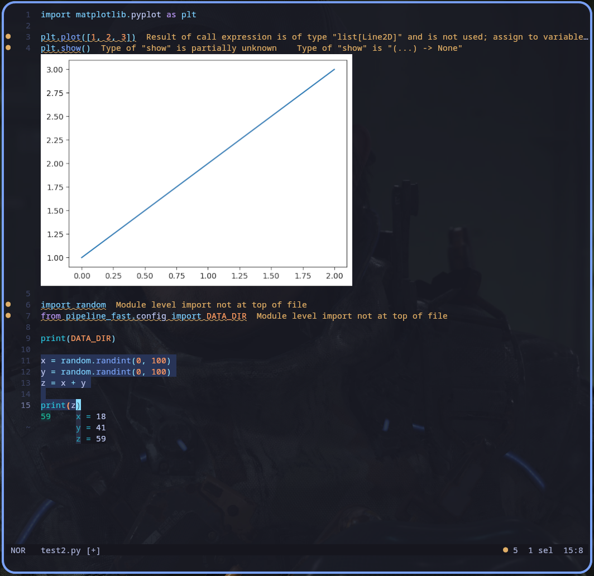

<h1>
<picture>
  <source media="(prefers-color-scheme: dark)" srcset="logo_dark.svg">
  <source media="(prefers-color-scheme: light)" srcset="logo_light.svg">
  
</picture>
</h1>

A [Kakoune](https://github.com/mawww/kakoune) / [Neovim](https://github.com/neovim/neovim) inspired editor, written in Rust.

## Additional Features

**Jupyter REPL** — Evaluate buffer selections in a persistent Jupyter kernel and render output inline, inspired by [Zed](https://zed.dev/docs/repl). Documentation [here](./REPL.md).

**Jupyter Notebook Support** — Open and edit `.ipynb` files with full kernel integration. The buffer displays cells in percent-format with inline outputs from stored notebook execution. Documentation [here](./NOTEBOOK.md).

**Code Folding** — Tree-sitter based code folding: collapse functions and classes to their signature line for easier navigation in large files. Keybindings in the `z` menu (`za` to toggle, `zM`/`zR` for fold/unfold all). Documentation [here](./FOLDING.md).

**Spell Checking** — Multi-language spell checker with support for LaTeX, Markdown, and Typst. Run as a language server with quick-fix code actions and project dictionary support. Documentation [here](./SPELL.md).

Note: The image displaying capabilities rely on [kitty's graphics protocol](https://sw.kovidgoyal.net/kitty/graphics-protocol/) and therefore only work in supported terminals.

---

# Original README
The editing model is very heavily based on Kakoune; during development I found
myself agreeing with most of Kakoune's design decisions.

For more information, see the [website](https://helix-editor.com) or
[documentation](https://docs.helix-editor.com/).

All shortcuts/keymaps can be found [in the documentation on the website](https://docs.helix-editor.com/keymap.html).

[Troubleshooting](https://github.com/helix-editor/helix/wiki/Troubleshooting)

# Features

- Vim-like modal editing
- Multiple selections
- Built-in language server support
- Smart, incremental syntax highlighting and code editing via tree-sitter

Although it's primarily a terminal-based editor, I am interested in exploring
a custom renderer (similar to Emacs) using wgpu.

Note: Only certain languages have indentation definitions at the moment. Check
`runtime/queries/<lang>/` for `indents.scm`.

# Installation

[Installation documentation](https://docs.helix-editor.com/install.html).

# Contributing

Contributing guidelines can be found [here](./docs/CONTRIBUTING.md).

# Getting help

Your question might already be answered on the [FAQ](https://github.com/helix-editor/helix/wiki/FAQ).

Discuss the project on the community [Matrix Space](https://matrix.to/#/#helix-community:matrix.org) (make sure to join `#helix-editor:matrix.org` if you're on a client that doesn't support Matrix Spaces yet).

# Credits

Thanks to [@jakenvac](https://github.com/jakenvac) for designing the logo!
